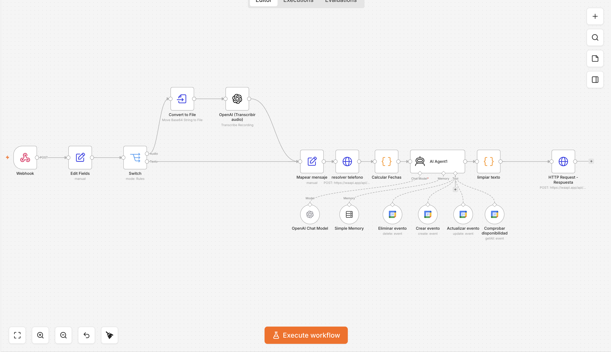

# AI WhatsApp Booking & Management Agent

An autonomous conversational AI agent built in n8n that manages customer appointments end-to-end via WhatsApp. It processes natural language (both text and voice notes), checks real-time calendar availability, and dynamically manages bookings without human intervention.

## 🚀 Architecture & Features

The system consists of two primary workflows operating in tandem:

### 1. Conversational Agent Engine (Booking Agent)
- **Omnichannel Input:** Connects to WhatsApp via WaAPI to receive incoming text messages and audio voice notes. Audio files are automatically transcribed using OpenAI's Whisper model.
- **LLM Orchestration:** Powered by LangChain and OpenAI (GPT-4), the agent acts as a virtual receptionist with strict system prompts regarding business hours, service durations, and tone of voice.
- **Dynamic Tool Calling:** The LLM is equipped with specialized tools to interact directly with the Google Calendar API. It autonomously executes:
  - `Check Availability`: Verifies open slots against existing events before confirming.
  - `Create/Update/Delete Event`: Manages the calendar state dynamically based on user intent.
- **State & Memory:** Utilizes a Memory Buffer Window tied to the user's WhatsApp ID to maintain conversation context across multiple messages.

### 2. Proactive Outreach (Automated Reminders)
- **CRON Execution:** A scheduled trigger runs daily to query the Google Calendar API for upcoming appointments.
- **Data Parsing:** Extracts structured client data (Name, Phone Number, Service type, Time) embedded within the calendar event descriptions.
- **Automated Dispatch:** Sends personalized WhatsApp reminder notifications via WaAPI to reduce no-shows.

## 🛠️ Tech Stack & Skills Demonstrated
- **Workflow Orchestration:** n8n (Webhooks, LangChain nodes, CRON triggers)
- **AI & NLP:** OpenAI API (GPT-4 & Audio Transcription)
- **Integrations:** WaAPI (WhatsApp Cloud), Google Calendar API
- **Data Processing:** JavaScript for date calculation, string manipulation, and payload sanitization

## 📸 Pipeline Visualizations

*(Screenshots of the modular workflows)*

